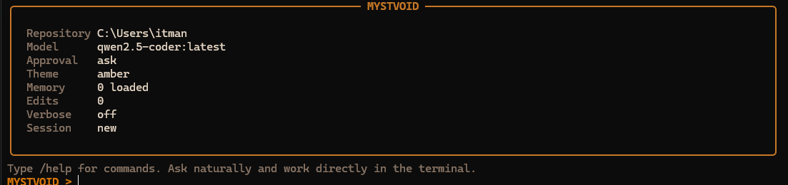

# MYSTVOID

MYSTVOID is a local repository agent for terminal-style development work. It analyzes a repository, chooses from a safe local toolset, asks for confirmation before risky actions, and runs entirely on Ollama models such as `qwen2.5-coder`, `deepseek-coder`, or `codellama`.

Tested on Windows with PowerShell 7.

Architecture:

```text
User -> FastAPI -> Agent loop -> Tools -> Ollama -> Response
```

## Screenshot



## Folder Structure

```text
local-code-agent/
├─ agent/
│  ├─ config.py
│  ├─ cli.py
│  ├─ loop.py
│  ├─ ollama_client.py
│  ├─ persistence.py
│  ├─ project_docs.py
│  ├─ repo_awareness.py
│  ├─ schemas.py
│  └─ session_store.py
├─ tools/
│  ├─ edit_operations.py
│  ├─ filesystem.py
│  ├─ git_tools.py
│  ├─ registry.py
│  ├─ safety.py
│  └─ shell.py
├─ api/
│  └─ server.py
├─ ui/
│  └─ index.html
├─ tests/
│  ├─ test_cli.py
│  ├─ test_edit_operations.py
│  ├─ test_loop.py
│  ├─ test_persistence.py
│  ├─ test_project_docs.py
│  ├─ test_safety.py
│  └─ test_tools.py
├─ README.md
├─ requirements.txt
├─ run_api.ps1
└─ run_terminal.ps1
```

## What It Can Do

- inspect a codebase
- answer questions about a project
- search code with ripgrep
- read and write files
- run safe commands such as tests or git diff/status
- request approval before file edits or non-safe commands
- explain its reasoning with short step traces
- use the same agent from a terminal REPL with command shortcuts and repository navigation
- auto-load project instruction files such as `AGENTS.md`
- show a warm terminal theme with panels, status blocks, and cleaner approvals
- show transparent slash-command suggestions as you type
- preview edits with unified diffs before approval
- apply focused file edits with `apply_patch`
- save edit checkpoints and undo the last approved edit
- auto-save and restore the last terminal session for the same repository
- expose richer code tools such as symbol grep, multi-file reads, git status, and run-tests
- let you type and queue the next prompt while the current request is still running

## Libraries Used

- `fastapi` for the local HTTP API
- `uvicorn` for serving the FastAPI app
- `ollama` for talking to local Ollama models from Python
- `pydantic` for request, response, and agent decision schemas
- `rich` for the styled terminal interface
- `prompt-toolkit` for transparent slash-command suggestions and completion
- `ripgrep` (`rg`) for fast repository code search
- standard library modules such as `pathlib`, `subprocess`, `threading`, and `json` for filesystem access, command execution, queueing, and persistence

## Tools

- `read_file(path)`
- `read_many_files(paths)`
- `write_file(path, content)`
- `apply_patch(path, search_text, replace_text, replace_all?, expected_occurrences?)`
- `search_code(query)` using `ripgrep`
- `grep_symbol(symbol)`
- `list_files(directory)`
- `open_file_at_line(path, line, context)`
- `run_tests()`
- `run_command(command)`
- `git_status()`
- `git_diff()`

## Safety Model

- all paths are restricted to the repository root for the session
- `write_file(...)` and `apply_patch(...)` require confirmation by default
- edit approvals show a diff preview before anything is written
- `run_command(...)` rejects dangerous command patterns
- non-allowlisted commands require explicit confirmation
- approved edits are checkpointed so `/undo` can restore the previous contents
- destructive git operations such as `git reset --hard` are blocked

## Installation

1. Create a virtual environment.

```powershell
py -3.10 -m venv .venv
.\.venv\Scripts\Activate.ps1
```

2. Install dependencies.

```powershell
python -m pip install --upgrade pip
pip install -r requirements.txt
```

This installs the terminal prompt extras too, including `prompt-toolkit` for transparent slash-command suggestions and completion.

3. Make sure `ripgrep` is available for `search_code`.

```powershell
rg --version
```

## Run Ollama

Start Ollama:

```powershell
ollama serve
```

Pull a local coding model, for example:

```powershell
ollama pull qwen2.5-coder:latest
```

Other good local models:

- `deepseek-coder:latest`
- `codellama:latest`

## Start The API

Option 1:

```powershell
.\run_api.ps1
```

Option 2:

```powershell
$env:PYTHONPATH = (Get-Location).Path
uvicorn api.server:app --host 127.0.0.1 --port 8000 --reload
```

Open the browser UI at:

```text
http://127.0.0.1:8000/ui/
```

The browser UI ships with a placeholder repository path. Replace it with the local repository you actually want the agent to inspect.

## Quick Start

1. Start Ollama with `ollama serve`.
2. Pull a coding model such as `ollama pull qwen2.5-coder:latest`.
3. Start the terminal with `.\run_terminal.ps1` or the API with `.\run_api.ps1`.
4. Point the session at your repository and start asking questions.

## Use It In The Terminal

Run the terminal REPL from the repository you want the agent to work on:

```powershell
cd C:\path\to\your-repo
C:\path\to\local-code-agent\run_terminal.ps1
```

By default it uses:

- your current working directory as the repository root
- the default Ollama model from `OLLAMA_MODEL` or `qwen2.5-coder:latest`
- the terminal theme from `--theme` or `amber`
- confirmation for writes and non-safe commands
- a compact answer-first terminal layout
- the last saved session for the same repository unless you pass `--fresh`
- background queue capture while a request is running
- transparent slash-command suggestions when `prompt-toolkit` is available

You can also run a one-shot prompt directly:

```powershell
C:\path\to\local-code-agent\run_terminal.ps1 "Explain this repository"
```

Start fresh instead of restoring the last session:

```powershell
C:\path\to\local-code-agent\run_terminal.ps1 --fresh
```

Approval modes:

- `ask`
- `auto-edit`
- `full-auto`

Example:

```powershell
C:\path\to\local-code-agent\run_terminal.ps1 --approval-mode auto-edit
```

Choose a startup theme:

```powershell
C:\path\to\local-code-agent\run_terminal.ps1 --theme midnight
```

If you want the older guided setup flow:

```powershell
.\run_terminal.ps1 --setup
```

Or pass the repo and model directly:

```powershell
.\run_terminal.ps1 --repo-path C:\path\to\your-repo --model qwen2.5-coder:latest
```

Terminal commands:

- `/`
- `/help`
- `/status`
- `/session`
- `/repo C:\path\to\repo`
- `go to Desktop`
- `cd ..`
- `/model`
- `/model qwen2.5-coder:latest`
- `/theme midnight`
- `/approvals auto-edit`
- `/memory`
- `/init`
- `/run-tests`
- `/open README.md:12`
- `/search auth middleware`
- `/files src`
- `/git`
- `/undo`
- `/checkpoints`
- `/history test`
- `/new`
- `/save`
- `/verbose on`
- `/steps`
- `/diff`
- `/clear`
- `/exit`

Example terminal prompts:

- `Explain the FastAPI architecture in this repository.`
- `go to Desktop`
- `switch to Downloads`
- `run tests`
- `open README.md`
- `undo last edit`
- `Search for the approval flow and summarize how write confirmations work.`
- `Run python -m pytest and explain any failures.`
- `Update README.md with a short Troubleshooting section.`

If the agent wants to edit a file or run a non-safe command, the terminal app pauses and asks for approval before continuing.
For edit approvals it shows a unified diff first, then lets you choose `yes`, `no`, or `always` for that approval type.
By default it prints the answer first and keeps detailed tool traces behind `/steps` or `/verbose on`.
Typing `/` and pressing Enter shows the available slash commands without sending anything to the agent or adding a chat turn.
Typing part of a slash command such as `/mo` shows a transparent suggestion in the prompt, and `Tab` completes it when the enhanced prompt is active.
Running `/model` lists the Ollama models installed locally and lets you pick one by number or exact name.
While the agent is thinking, you can keep typing in the same terminal and press Enter to queue the next message.
The spinner also shows a short live hint about what the agent is doing, such as planning, reading files, or running a tool.

Autosave location:

```text
%LOCALAPPDATA%\MYSTVOID
```

## Memory Files

The terminal agent automatically loads repository-level instruction files when present:

- `AGENTS.md`

Use `/memory` to see which ones are active.

Use `/init` to generate a starter `AGENTS.md` in the current repository.

## Undo And Checkpoints

Every approved file edit stores a checkpoint.

- Use `/checkpoints` to inspect recent edits.
- Use `/undo` to restore the most recent approved edit.
- Switching repositories clears the undo stack for safety.

## API Usage

### 1. Create A Session

```http
POST /sessions
Content-Type: application/json

{
  "repo_path": "C:\\path\\to\\your-repo",
  "model": "qwen2.5-coder:latest",
  "auto_approve_writes": false,
  "auto_approve_commands": false
}
```

### 2. Ask The Agent To Work

```http
POST /sessions/{session_id}/run
Content-Type: application/json

{
  "message": "Inspect the FastAPI server, explain the architecture, and suggest one improvement."
}
```

### 3. Approve A Pending Write Or Command

If the agent wants to edit a file or run a non-safe command, the API returns `status = "needs_confirmation"` with an `approval_id`.

```http
POST /sessions/{session_id}/approve
Content-Type: application/json

{
  "approval_id": "abc123",
  "approve": true
}
```

Pending approvals now include a `preview` field so API clients can display edit diffs before approval.

## Example Prompts

- `Explain the structure of this repository and which files are most important.`
- `Search for the FastAPI app and summarize all endpoints.`
- `Find the failing tests and propose a fix without editing files yet.`
- `Inspect the pytest configuration and then run python -m pytest.`
- `Update README.md with a short Quick Start section.`  
  This should trigger a write approval.

## Agent Loop

The agent loop in `agent/loop.py` works like this:

1. send the user request, repo path, and tool catalog to the Ollama model
2. ask the model to return either:
   - a tool call
   - or a final answer
3. execute the requested tool if it is safe
4. if the action needs approval, pause and return `needs_confirmation`
5. feed the tool result back into the loop
6. stop when the model returns a final answer or max steps are reached

## Runnable Core Files

- Agent loop: `agent/loop.py`
- Terminal REPL: `agent/cli.py`
- Session persistence: `agent/persistence.py`
- Repo summary cache: `agent/repo_awareness.py`
- Project memory loader: `agent/project_docs.py`
- Ollama integration: `agent/ollama_client.py`
- Tool implementations: `tools/filesystem.py`, `tools/shell.py`, `tools/git_tools.py`, `tools/edit_operations.py`
- FastAPI server: `api/server.py`

## Notes

- This project is intentionally simple and clear rather than heavily abstracted.
- It runs 100% locally with Ollama and no paid APIs.
- The model is instructed to keep reasoning summaries short and practical.
- The terminal UX borrows common terminal-agent patterns such as natural repo navigation, diff-first approvals, and persistent local sessions, but everything is implemented locally with Python and Ollama.
- If transparent slash suggestions do not appear, make sure you are running the app in a normal PowerShell console with the project dependencies installed.
